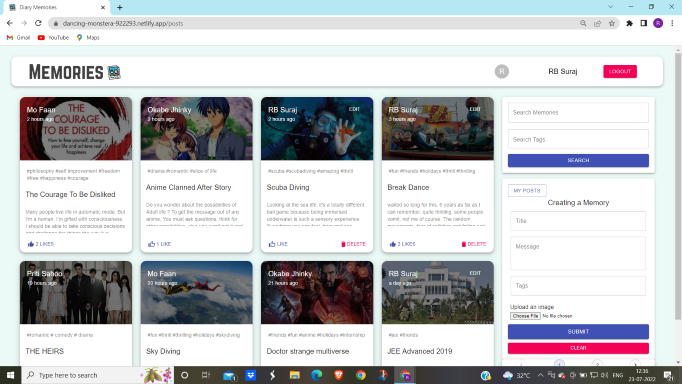
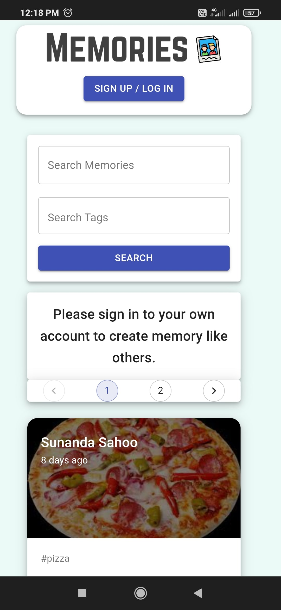
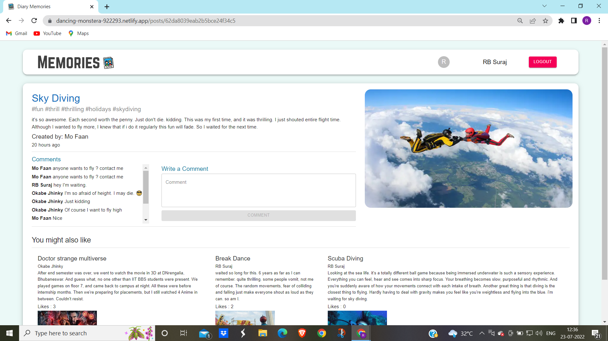
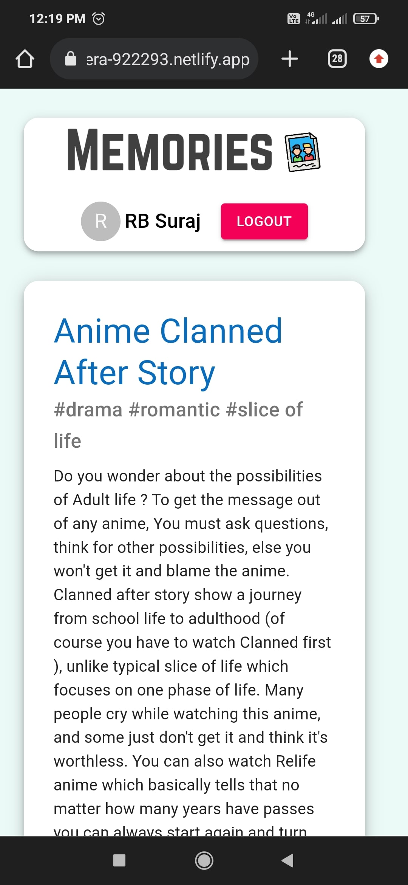
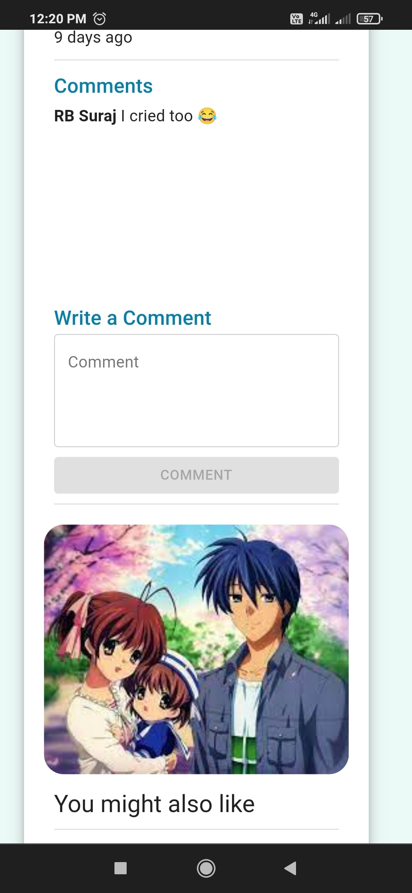

# [[Memory-Diary](https://dancing-monstera-922293.netlify.app/)]
`Memory-Diary` is a responsive MERN stack web app to store your valuable memories.
[[App link](https://dancing-monstera-922293.netlify.app/)]

## Tech Stack
MERN stack 
Material UI library for react components 
Redux sate management tool

## Features
- [x] User signup/login with JWT authentication
- [x] create memory, like, comment, delete own post features for logged in users
- [x] details view, search by title or tags, pagination features for all users

## Demo images
### Home page -

 
 

 
 

### Details page -

 
 

 
 

 
 
